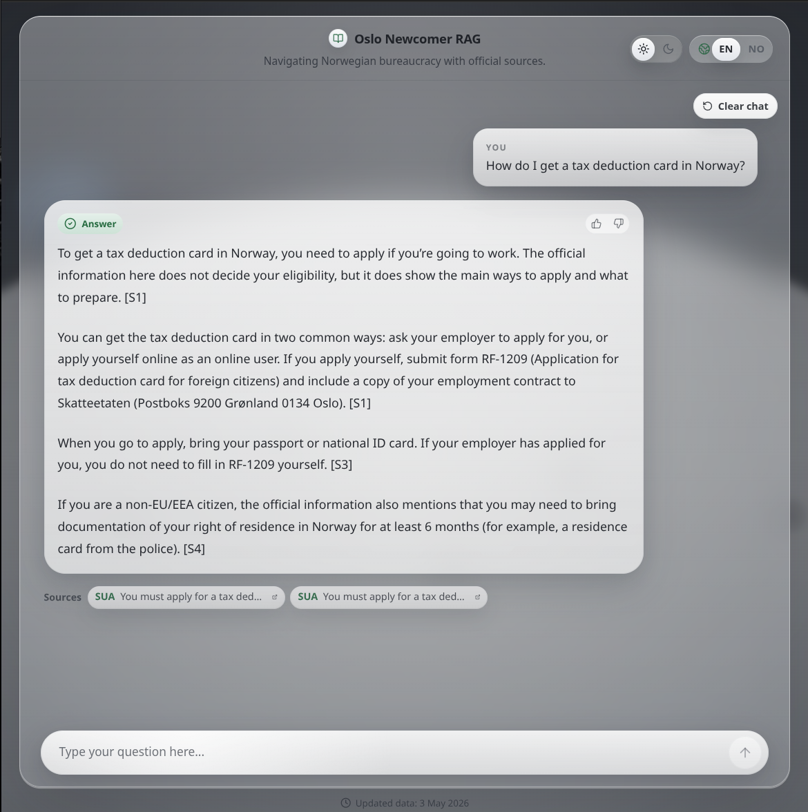
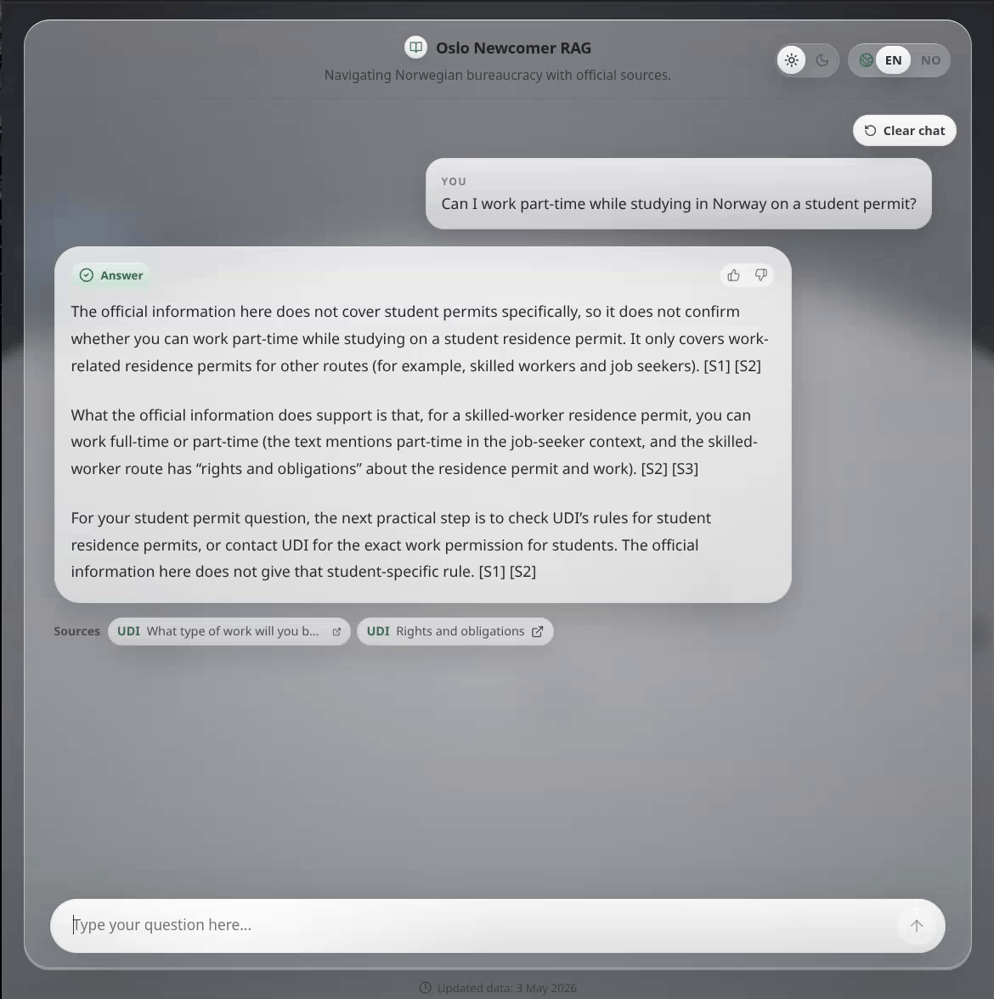
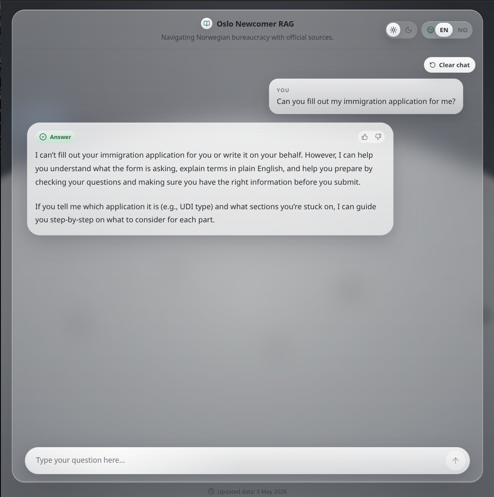
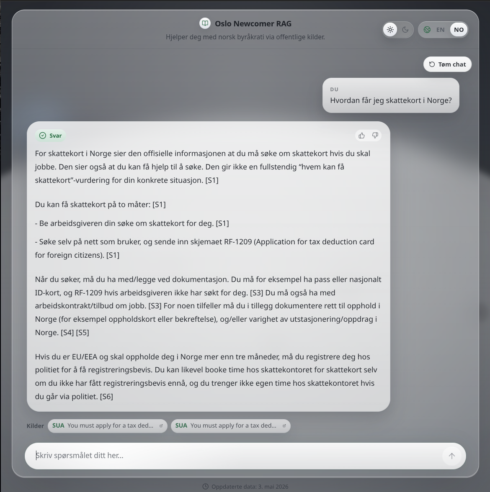

# Oslo Newcomer RAG

I built this as a small portfolio project for newcomers who need a simpler, more accessible way to navigate official Norwegian public-service information. The app answers questions about moving to Oslo, permits, tax, work, housing, healthcare, and student life using a stored snapshot of official sources.

The goal is not to replace UDI, NAV, Skatteetaten, Oslo kommune, SUA, or SiO. I wanted the demo to point users to the right official page, explain the answer in plain language, and show citations every time.

**Live demo:** https://your-demo-url.example

<p align="center">
  
  <br>
  <sub>Tax deduction card answer with official-source citations.</sub>
</p>

## Screenshots

<p align="center">
  
  <br>
  <sub>Theme toggle on a cautious student-permit work question.</sub>
</p>

<table>
  <tr>
    <td width="50%" align="center">
      
      <br>
      <sub>Refusal to fill out an immigration application.</sub>
    </td>
    <td width="50%" align="center">
      
      <br>
      <sub>Norwegian tax card answer with cited sources.</sub>
    </td>
  </tr>
</table>

## Tech Stack

- **Backend:** FastAPI, Pydantic, SQLAlchemy, Alembic
- **Database:** Postgres with pgvector
- **Frontend:** React, TypeScript, Vite, Tailwind CSS
- **Retrieval:** hybrid keyword and vector search over stored official-source chunks
- **Models:** OpenAI-compatible chat and embedding endpoints set through environment variables
- **Evaluation:** pytest plus a small RAG evaluation set in `eval/gold_questions.yml`

## What The App Does

- Uses only allowlisted official sources from `sources.yml`
- Stores source URL, section heading, collection date, and official last-updated date when available
- Answers with citations instead of unsupported claims
- Refuses low-confidence or personal legal-risk questions
- Stores anonymous feedback without saving the question or answer text
- Avoids live web search during chat; answers come from the stored snapshot

## Run It Locally With Docker

Create your local environment file:

```bash
cp .env.example .env
```

Fill in your local values in `.env`. Keep real keys out of Git.

Start the app and database:

```bash
docker compose up --build
```

In a second terminal, prepare the database and source snapshot:

```bash
docker compose exec app uv run alembic upgrade head
docker compose exec app uv run oslo-ingest-sources
docker compose exec app uv run oslo-build-embeddings
```

Open the app:

```text
http://localhost:8000
```

Useful checks:

```bash
curl http://localhost:8000/healthz
curl http://localhost:8000/api/sources
```

## RAG Evaluation

The evaluation set includes supported questions, unsupported questions, mixed-language prompts, and legal-risk prompts. It is small on purpose, but it catches the main mistakes I care about in this demo.

Run the backend tests:

```bash
uv run pytest
```

Run the RAG evaluation:

```bash
uv run rag-eval
```

The report includes:

- context precision
- context recall
- faithfulness
- answer relevance
- citation coverage
- refusal correctness
- language match

Run the release check before committing:

```bash
uv run release-check
```

## Deployment Notes

The Docker image builds the React frontend and serves it from the FastAPI app, so the public demo can run from one web service. A hosted version still needs a Postgres database with pgvector and the same environment variables used locally.

The first production setup needs one manual seed step:

```bash
uv run alembic upgrade head
uv run oslo-ingest-sources
uv run oslo-build-embeddings
```
