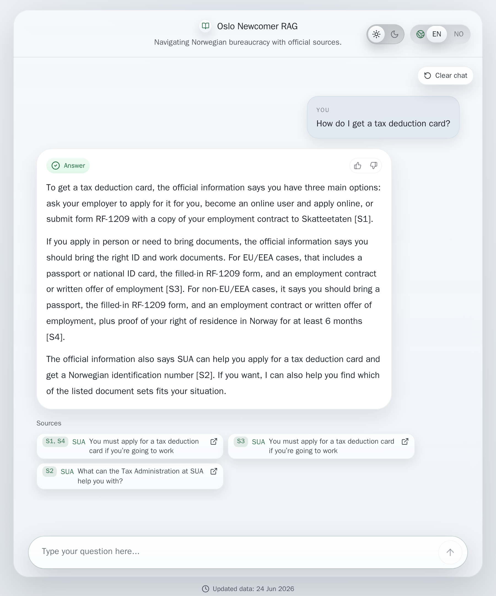
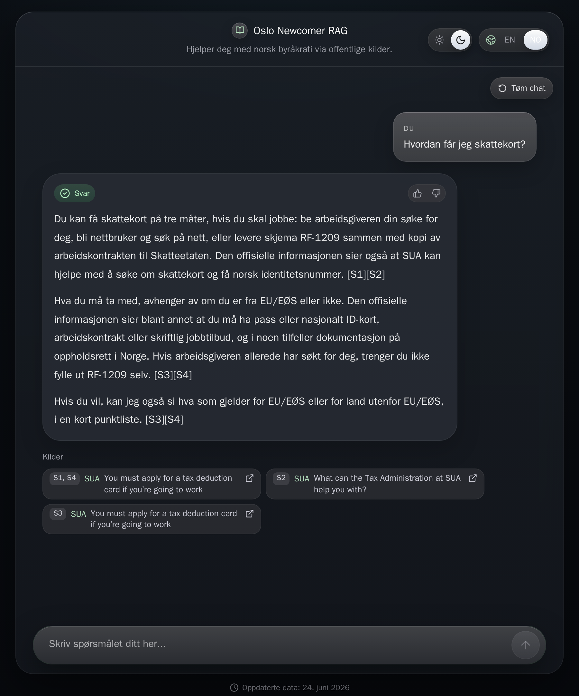

# Oslo Newcomer RAG

A question-answering app for people who have just moved to Oslo and need to find their way through Norwegian public services. It answers questions about permits, tax, work, housing, healthcare, and student life, and it backs every answer with a link to the official source page.

I built it as a portfolio project. The point is not to replace UDI, NAV, Skatteetaten, Oslo kommune, SUA, or SiO, but to make their information easier to reach. You ask a question in plain language, you get a short answer, and you see exactly which official page it came from.

## Live demo

https://oslo-newcomer-rag-xqhde.ondigitalocean.app/

## Screenshots

<table width="100%">
  <tr>
    <td width="50%"></td>
    <td width="50%"></td>
  </tr>
  <tr>
    <td align="center"><sub>A cited answer in light mode.</sub></td>
    <td align="center"><sub>Dark mode, answering in Norwegian.</sub></td>
  </tr>
</table>

## What it does

- Answers only from a fixed set of allowlisted official sources, listed in `sources.yml`.
- Cites the source on every factual claim, with the owner, the section heading, and a link to the page.
- Keeps the collection date and the official last-updated date for each source.
- Refuses the things it should not do, such as personal-record lookups, eligibility decisions, legal advice, and filling in forms.
- Works in English and Norwegian, and replies in the language you asked in.
- Saves anonymous thumbs-up or thumbs-down feedback, without storing the question or the answer text.
- Runs no live web search. Answers come from a one-time snapshot, so the results are stable and easy to check.

## Tech stack

- Backend: FastAPI, Pydantic, SQLAlchemy, Alembic
- Database: PostgreSQL with the pgvector extension
- Frontend: React, TypeScript, Vite, Tailwind CSS
- Retrieval: hybrid search that mixes vector similarity with Postgres full-text search
- Models: any OpenAI-compatible chat and embedding endpoint, set through environment variables
- Tests: pytest for the backend, Playwright for the frontend, and a small RAG evaluation set

## How it works

1. Ingestion fetches the allowlisted pages once, parses them into sections, splits them into chunks, and stores the snapshot. This is a one-time command, not a live crawl.
2. Retrieval embeds the question, runs vector and keyword search together, expands a few domain terms, and gates low-confidence matches so the app can say when it does not have an answer.
3. Generation passes the retrieved chunks to the chat model with strict instructions to answer only from that material and to cite each claim.
4. Evaluation scores the answers against an offline gold set before changes go out.

It runs as a single web service. The Docker image builds the React frontend and serves it from the FastAPI app.

## Run it locally

You need Docker and a `.env` file with database values and an OpenAI-compatible API key.

Copy the example file and fill in your own values:

```bash
cp .env.example .env
```

Start the app and the database:

```bash
docker compose up --build
```

In a second terminal, set up the schema and the source snapshot:

```bash
docker compose exec app uv run alembic upgrade head
docker compose exec app uv run oslo-ingest-sources
docker compose exec app uv run oslo-build-embeddings
```

The app is then at http://localhost:8000. Two quick checks:

```bash
curl http://localhost:8000/healthz
curl http://localhost:8000/api/sources
```

## Evaluation

The gold set in `eval/gold_questions.yml` covers supported questions, unsupported questions, mixed-language prompts, and questions the app should refuse. It is small on purpose, but it catches the mistakes that matter for this kind of app.

Run the backend tests:

```bash
uv run pytest
```

Run the RAG evaluation:

```bash
uv run rag-eval
```

The report covers context precision, context recall, faithfulness, answer relevance, citation coverage, refusal correctness, and language match.

Run the hygiene check before committing:

```bash
uv run release-check
```

## Deployment

The public demo runs as one web service with a managed Postgres database that has pgvector, using the same environment variables as the local setup. A fresh deployment needs the seed step once:

```bash
uv run alembic upgrade head
uv run oslo-ingest-sources
uv run oslo-build-embeddings
```
